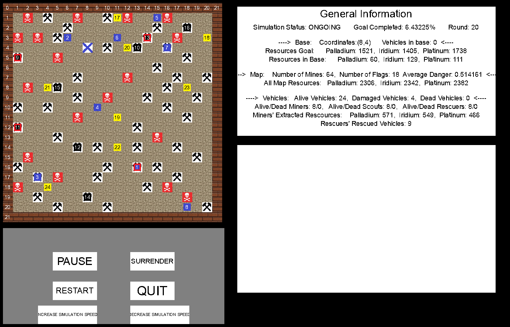

# simulation-coding-exercise
C++ Coding Exercise. Simulation with graphical interface.

Three types of vechiles (miners, scouts and rescuers) are moving inside a map that contains both resources and mines.
- Scouts discover resources and mines and flag them.
- Miners mine resources from locations that contain resources and bring them back to the base.
- Rescuers come to the aid of damaged miners who have accidentally stepped on a mine.

The goal of the simulation is to gather all resources on the map.

# Dependencies
SDL-1.2.15
SDL_ttf-2.0.11

# Build
In linux, install dependencies and use `make` to build. The executable is named `simulation`.
or
Create a docker image using the Dockerfile available.

# Simulation Screenshot

# Project Diagram

